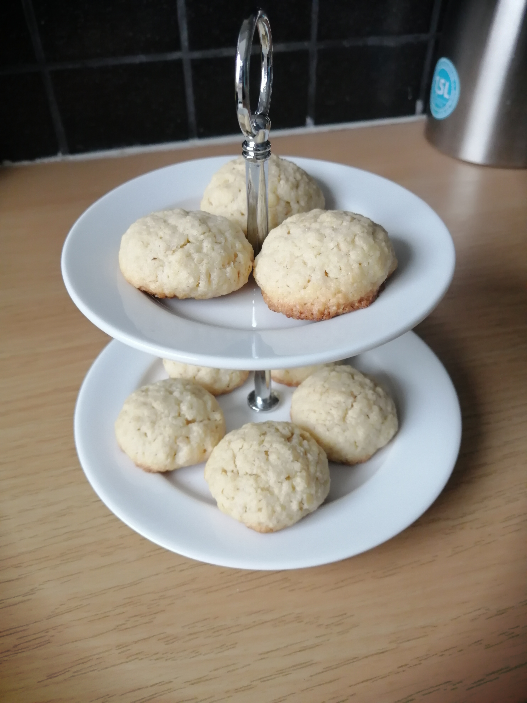

= Haferkekse

* Zubereitung: ca. 15 Minuten
* Backzeit: ca. 12 Minuten pro Blech
* Für ca 25 Stück
  
== Zutaten

* 120 g	Butter
* 120 g	Zucker
* 1 Ei
* 1 Prise Salz
* 90 g Haferflocken
* 80 g Mandeln, gemahlen
* 80 g Mehl
* 1 TL Backpulver
* 1 Prise	Zimt

== Zubereitung

* Weiche Butter mit Zucker und Ei schaumig rühren, restliche Zutaten separat mischen dann nach und nach zur Buttermischung geben.

* Ofen auf 180 Grad vorheizen und Backpapier aufs Blech legen.

* Mit einem Löffel etwas Teig abstechen und daraus mit der Hand kleine Kugeln formen und mit weitem Abstand aufs vorbereitete Blech legen. Auf mittlerer Schiene ca. 12 - 14 Min. backen. 

* Die noch weichen Kekse vom Blech nehmen und auskühlen lassen.

---

Quelle: https://www.chefkoch.de/rezepte/930771198403305/Haferplaetzchen-Haferkekse.html