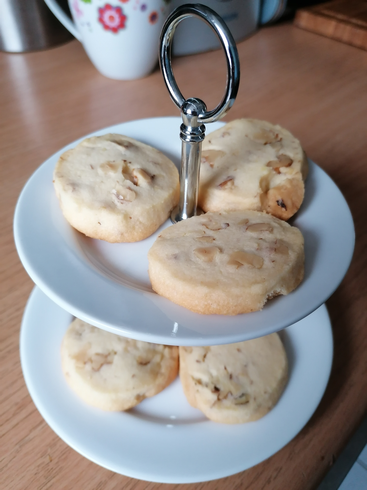

= Walnuss-Mürbchen

* Zubereitung: ca. 30 Minuten
* Ruhezeit: ca. 2 Stunden
* Backzeit: ca. 20 Minuten pro Blech
* Für ca 25 Stück

== Zutaten

- 200 g Butter
- 100 g	Puderzucker
- 1 Eigelb
- 1 Prise Salz
- 1 Pck. Vanillezucker
- 100 g	Walnüsse, grob gehackt
- 300 g	Mehl

== Zubereitung

- Die Butter mit dem gesiebten Puderzucker und dem Eigelb glatt rühren. Mit Salz und Vanillezucker abschmecken.
- Die grob gehackten Walnüsse zugeben und das Mehl darüber sieben. Kurz durchkneten, bis eine einheitliche Masse entsteht. Rollen (Ø ca. 4 cm) formen und im Kühlschrank durchkühlen lassen.
- Aus den Rollen Scheiben von ca. 1/2 cm Stärke abschneiden und auf ein mit Backpapier ausgelegtes Blech legen.
- Im ca. 170°C heißen Backofen 20 - 25 Min. backen.

---

Quelle: https://www.chefkoch.de/rezepte/668091168785558/Walnuss-Muerbchen.html
